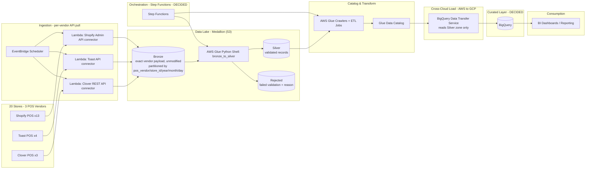

# POS Data Pipeline — Architecture Plan

Status: **Planning** — no infrastructure has been built yet. This document captures the proposed architecture and open decisions for a data pipeline covering 20+ retail stores.

## Goals

- Consolidate POS data from 20+ stores into a single source of truth.
- Support next-day reporting for all stores; leave room for same-day/near-real-time visibility if needed later.
- Keep cost low given bursty, end-of-day-heavy load patterns.

## Usage Pattern

- **Pipeline**: runs **daily** — ingest + merge/upsert new orders into the curated layer.
- **Analysis**: runs **weekly**, Fridays only. No same-day/real-time requirement.

This shapes the curated-warehouse decision below: idle-cost-during-the-week matters more than raw query throughput.

## Proposed Architecture



## Layer Notes

| Layer | Choice | Rationale |
|---|---|---|
| Ingestion | Per-vendor API pull (Shopify Admin API, Toast API, Clover REST API), scheduled via EventBridge + Lambda | All 3 vendors are cloud POS with REST APIs — no on-prem DB, so no DMS/CDC needed. Each vendor gets its own connector since schemas and auth differ |
| Bronze | S3, partitioned by `pos_vendor/store_id/year/month/day` | Exact, unmodified vendor payload — cheap, immutable, append-only, replayable if validation rules change later |
| Validation (bronze → silver) | AWS Glue **Python Shell** job (`glue_jobs/bronze_to_silver.py`) | Splits bronze into `silver/` (valid) and `rejected/` (invalid + reason), decoupled from ingestion so rules can evolve/be rerun without re-polling vendor APIs. Python Shell, not Spark — at 500-700MB/day this is a boto3 list+validate loop, not a distributed job |
| Catalog & transform | AWS Glue | Crawlers auto-sync schema as new store data lands; normalize 3 vendor schemas into one common order/transaction model here, reading from `silver/` |
| Orchestration | **Step Functions** (decided) | Serverless, pay-per-state-transition, zero idle cost — fits a simple daily DAG (3 connectors → bronze_to_silver validation → Glue transform → BigQuery load). MWAA/Airflow and Dagster both carry a persistent base infrastructure cost (MWAA's smallest environment alone runs ~$350+/month) that would dwarf the rest of this pipeline's cost for a DAG this small |
| Curated warehouse (gold) | **BigQuery** (decided) | See below |

## Repo Layout

```
connectors/          # one class per vendor: polls the API, writes unmodified payload to S3 bronze/
lambda_handlers/      # thin Lambda entrypoints (one per vendor), loop over that vendor's stores
glue_jobs/bronze_to_silver.py  # Glue Python Shell job: validates bronze/, splits to silver/ + rejected/
validation/rules.py   # single source of truth for per-vendor required fields + validate_record()
common/s3_paths.py    # shared S3 key/partition-scheme helper used by connectors
config/stores.example.yaml   # copy to stores.yaml (gitignored) and fill in real store/credential refs
gcp_alerting/teams_notifier/  # Pub/Sub-triggered Cloud Function: BQ DTS failure -> Teams webhook
requirements.txt
.env.example
```

Each connector polls its vendor's API for orders updated since the last run and writes the payload,
unmodified, to
`s3://<bucket>/bronze/pos_vendor=<vendor>/store_id=<id>/year=/month=/day=/orders_<timestamp>.json`.
No validation happens at ingestion — see [Data Validation](#data-validation) below for how bronze
becomes silver/rejected downstream. Lambda handlers are meant to be triggered on a schedule
(EventBridge), one rule per vendor, per the architecture diagram above. This is boilerplate — auth
flows, pagination, and error handling are minimal and need hardening before production use.

### Retry & Backoff

All HTTP calls in `connectors/base.py` (`BasePOSConnector._request`) share one retry strategy:

- Retries on connection/timeout errors and on `429`/`500`/`502`/`503`/`504` responses.
- Exponential backoff with full jitter (`random.uniform(0, min(60s, 1s × 2^attempt))`), up to 5 attempts.
- Honors a vendor's `Retry-After` header when present, falling back to jittered backoff otherwise.
- S3 writes use boto3's `adaptive` retry mode (5 max attempts) for transient throttling on upload.

Caveat: Lambda has a 15-minute execution timeout. A worst-case run (5 attempts × up to 60s backoff)
could approach that limit if a vendor API is degraded — fine for boilerplate, worth monitoring once live.

### Data Validation

Medallion pattern: **bronze stays immutable**, validation happens as a separate downstream step so
rules can change/be rerun without re-polling vendor APIs.

- **Bronze** (`connectors/*`): each connector writes exactly what the vendor API returned, no
  filtering, to the `bronze/` zone. `run()` returns a single S3 key (or `None` if nothing new).
- **Bronze → silver/rejected** (`glue_jobs/bronze_to_silver.py`): an AWS Glue **Python Shell** job
  (boto3, no Spark — appropriate at 500-700MB/day), triggered by Step Functions once a day's
  ingestion runs are done. For each bronze object it validates every record against
  `validation/rules.py`'s per-vendor `required_fields` and writes:
  - **Valid records** → `silver/` zone.
  - **Invalid records** → `rejected/` zone, tagged with a `_validation_error` field describing
    which check failed (e.g. `missing required field: total_price`).

  Both mirror the same `pos_vendor/store_id/year/month/day` partitioning as bronze — the job just
  swaps the leading zone prefix, so reruns are idempotent (same input → same output keys).

| Vendor  | `required_fields` (in `validation/rules.py`) |
|---------|----------------------------------------------|
| Shopify | `id`, `created_at`, `total_price`             |
| Toast   | `guid`, `businessDate`                        |
| Clover  | `id`, `createdTime`                            |

(Confirmed against each vendor's official Orders API docs — see [Normalized Order
Model](#normalized-order-model-bronze--silver--curated).)

This is presence/non-empty validation only — no type, range, or referential checks yet. The Glue
crawler/transform step and the BigQuery load both read from `silver/`, never `bronze/` or
`rejected/` directly.

### Schema Drift Detection & Alerting

A vendor changing their API can hit the pipeline two different ways, and `bronze_to_silver.py`
watches for both — see `validation/rules.py`:

- **A required field gets renamed/removed** (breaking change) — `validate_record()` starts
  rejecting most or all records for that vendor. Not a crash: they land safely in `rejected/`, but
  silently, since the Glue job itself still "succeeds."
- **A new field gets added** (additive change, e.g. the Clover-adds-a-column case) — harmless to
  bronze/silver (extra keys are just carried through), but easy to miss forever since nothing
  fails. `detect_new_fields()` diffs each record's top-level keys against a `KNOWN_FIELDS` baseline
  captured from each vendor's docs.

**Alerting: DECIDED — S3 Event Notification on the `rejected/` prefix**, not a batch metric
threshold. An S3 `PUT` event on `rejected/*` fires the moment `bronze_to_silver.py` writes even a
single rejected record — publishing to the same shared SNS topic already used for Lambda/Glue/Step
Functions failures (see [Alerting & Failure
Notifications](#alerting--failure-notifications-microsoft-teams)), which AWS Chatbot forwards to
Teams. No custom code — same pattern as the other AWS-side alerts, just a bucket notification
config change. This was chosen over a daily ratio-threshold alarm specifically so a *small* number
of bad rows (e.g. 20 out of 1,000 — a 2% ratio) still gets flagged immediately, not just a schema
break severe enough to blow past some percentage threshold.

`RejectedRatio` and `NewFieldCount` are still computed and logged/emitted to CloudWatch (namespace
`POSPipeline/Validation`, dimensioned by `Vendor`) — kept as a diagnostic/trend signal for *why* a
rejected object showed up (which reasons, which new fields), surfaced once you've already been
alerted by the S3 event, not as the alert trigger itself.

Note this only catches *known* fields disappearing or *unknown* fields appearing — it can't detect
a field that keeps its name but silently changes meaning/type (e.g. Clover re-scaling `taxRates`).
That class of drift would need type/range checks added to `validate_record()` later.

### Runbook: Handling Rejected Records

Getting alerted (via the S3 event above) is the start, not the end — rejected records need a
person to look at them. Rejected rows are never auto-fixed or auto-promoted to `silver/`.

1. **Triage the reason.** Each rejected record carries a `_validation_error` field (e.g.
   `missing required field: total_price`), and the S3 key path gives you vendor/store/day for
   free. That's almost always enough to bucket it as one of:
   - **A one-off bad record from the vendor** (a void, a test transaction, a genuinely incomplete
     API response) — correctly rejected, nothing to fix. Leave it in `rejected/`.
   - **A real schema change** — matches what [Schema Drift Detection &
     Alerting](#schema-drift-detection--alerting) is designed to catch (a required field renamed/
     removed, or an unrecognized new field showing up repeatedly).

2. **Fix the root cause, don't patch the symptom.** If it's a schema change, update
   `validation/rules.py` (`REQUIRED_FIELDS`/`KNOWN_FIELDS`) to reflect the vendor's new reality, and
   touch the connector only if the polling logic itself broke. **Never inject a placeholder/default
   value just to force a record into `silver/`** — a field is required because downstream Friday
   reporting depends on it; faking it silently corrupts numbers instead of surfacing a real gap.

3. **Reprocess, don't hand-backfill.** Once the rule (or vendor data) is fixed, rerun
   `bronze_to_silver.py --bucket <bucket> --run-date <affected date>`. Bronze is never touched and
   silver/rejected keys are derived deterministically from the bronze key, so records that now pass
   validation land in `silver/` automatically — no separate backfill tooling needed.

4. **Don't let `rejected/` grow forever untriaged.** Not yet built: an S3 lifecycle rule to expire
   `rejected/` objects after a retention window (e.g. 90 days) once they've been reviewed, so old
   rejects don't sit as silent clutter even though arrival is now alerted on immediately.

## POS Integration Notes

| Vendor | Stores | Integration | Notes |
|---|---|---|---|
| Shopify | 13 | Admin REST/GraphQL API (poll); webhooks available | **Caution**: Shopify's REST Admin API is legacy — apps created after Oct 1, 2024 can't get the `read_all_orders` scope and are capped at the **last 60 days** of order history unless granted a "Protected customer data" review exception. GraphQL Admin API is the officially recommended path going forward; worth switching the connector to GraphQL before this matters for historical backfills |
| Toast | 4 | Orders API `ordersBulk` (poll) | Requires Toast partner/API credentials per restaurant group — confirm access is available before building the connector. Poll by `startDate`/`endDate` (modification time), not `businessDate` — Toast's own guidance warns `businessDate` misses same-day-created orders modified later. Rate-limited to 5 req/location/sec |
| Clover | 3 | REST API (poll); webhooks available | App Market also offers pre-built export integrations worth evaluating vs. a custom connector. Clover's own docs are acknowledged as incomplete — cross-check the `clover-android-sdk` GitHub repo's model classes for ground truth if a field looks off |

## Normalized Order Model (Bronze → Silver → Curated)

Confirmed against each vendor's official API docs (see per-field notes below). This is the target
shape for the Glue "Catalog & transform" step — flattening each vendor's schema into one common
model before it reaches BigQuery. Still to validate against real sandbox data before finalizing:
`status` mapping, `business_date` derivation for Shopify/Clover, and tender-type mapping.

**`orders` (header, one row per order)**

| Field | Type | Shopify source | Toast source | Clover source |
|---|---|---|---|---|
| `order_id` | string | `id` | `guid` | `id` |
| `store_id` | string | internal store config, not from vendor | same | same |
| `created_at` | timestamp | `created_at` | `createdDate` | `createdTime` (epoch **ms** — convert) |
| `updated_at` | timestamp | `updated_at` | `modifiedDate` | `modifiedTime` (epoch **ms** — convert) |
| `business_date` | date | derive from `created_at` in store tz | native: `businessDate` (int `YYYYMMDD`) | derive from `createdTime` in store tz |
| `status` | string (needs enum mapping) | `financial_status` + `fulfillment_status` | `voided`/`deleted`/`approvalStatus` | `state` + `paymentState` |
| `currency` | string | `currency` | not on Order — assume store-level default | `currency` |
| `subtotal_amount` | numeric | `subtotal_price` | sum of check `amount` (pre-tax) | sum of line item `price` (cents ÷ 100) |
| `discount_amount` | numeric | `total_discounts` | sum of `appliedDiscounts.discountAmount` | sum of `discounts` array |
| `tax_amount` | numeric | `total_tax` | sum of check `taxAmount` | sum of line item `taxRates` amounts |
| `total_amount` | numeric | `total_price` (string decimal) | sum of check `totalAmount` | `total` (cents ÷ 100) |

**`line_items` (nested/repeated per order — BigQuery `RECORD` fits well here)**

| Field | Shopify source | Toast source | Clover source |
|---|---|---|---|
| `line_item_id` | `line_items[].id` | `selections[].guid` | `lineItems[].id` |
| `item_name` | `title` | `displayName` (via item ref) | `name` |
| `quantity` | `quantity` | `quantity` | `unitQty` |
| `unit_price` | `price` | `price` | `price` (cents ÷ 100) |
| `discount_amount` | `discount_allocations` sum | `appliedDiscounts` sum | order-level `discounts`, no native line-item split |
| `tax_amount` | line-item `tax_lines` sum | `appliedTaxes` sum | `taxRates` sum (rate scaled ×1,000,000 — divide down) |

**`payments` (nested/repeated per order)**

| Field | Shopify source | Toast source | Clover source |
|---|---|---|---|
| `payment_id` | Transactions API `id` | `Check.payments[].guid` | Payments API `id` |
| `tender_type` | Transaction `gateway` | `payments[].type` (`CASH`/`CREDIT`/`GIFT_CARD`/...) | `payType` / Payment `result` |
| `amount` | Transaction `amount` | `payments[].amount` | Payment `amount` (cents ÷ 100) |
| `tip_amount` | order `total_tip_received` (not per-payment) | `payments[].tipAmount` | via `serviceCharge`, not a clean per-payment field |

**Key vendor quirks to handle in the transform:**
- **Clover** money is integer **cents** and tax rate is scaled by **1,000,000** (e.g. `1000000` = 10%); timestamps are epoch **milliseconds**. All three need conversion before landing in a common numeric/timestamp shape.
- **Shopify payments are not on the Order object** — they require a separate call per order to the Transactions API (`GET /admin/api/{version}/orders/{order_id}/transactions.json`).
- **Toast orders can have multiple `checks`** (e.g. split checks), each with its own `payments` and `selections` — line items and payments must be flattened across all checks under one order, not just the first.
- **Clover payments** are similarly a separate Payments API (`GET /v3/merchants/{mId}/payments`) unless fetched inline via `?expand=payments` on the order.

## Curated Warehouse Evaluation (superseded by decision below)

| | Redshift Serverless | Delta/Iceberg on S3 (via Glue + Athena) |
|---|---|---|
| Cost model | Scales to near-zero when idle, but has warehouse-level compute overhead | Pay only for storage + per-query scan; ~$0 when idle |
| Best fit | Frequent/concurrent BI dashboard queries throughout the day | Mostly nightly/batch reporting, low query concurrency |
| AWS-native support | First-class | Strong for Iceberg; Delta requires Databricks or EMR for full feature support |
| Added complexity | Low — fully managed warehouse | Low-medium — need to pick a table format and compute engine |

Leaning toward **Iceberg over Delta** if staying AWS-native (no Databricks), since Athena/Glue/Redshift all have first-class Iceberg support.

### Curated Warehouse Charging Comparison

Given the [usage pattern](#usage-pattern) — daily merge/upsert, analysis only on Fridays — how each
platform *bills*, not just its list price, matters:

| Platform | Billing unit | Idle cost (Mon–Thu) | Daily merge/upsert cost driver | Friday analysis cost driver |
|---|---|---|---|---|
| **Redshift Serverless** | RPU-hours (per-second, 60s min) | Auto-pauses → ~$0 | Compute *time*, not bytes touched | Compute time during query burst |
| **BigQuery** (on-demand) | $ per TB scanned per query | $0 | **Bytes scanned** by the MERGE, including the target table if pruning is poor | Bytes scanned |
| **Azure Synapse Serverless SQL** | $ per TB processed | $0 | Bytes scanned (same model as BigQuery) | Bytes scanned |
| **Databricks (DBU)** | DBU-hour × cluster type, on top of VM cost | ~$0 with ephemeral Jobs clusters | Job cluster runtime | SQL Warehouse runtime (auto-suspends, cold-start lag on resume) |

Note: BigQuery/Synapse Serverless bill the daily MERGE by bytes scanned, so an unpruned merge against
a growing table gets quietly more expensive every day even though it's a small write. Redshift
Serverless and Databricks Jobs compute bill by time, so a well-partitioned nightly merge stays cheap
regardless of total table size. At this pipeline's actual volume (500-700MB/day), that distinction
turns out not to matter much — all options are cheap in absolute terms.

### Actual Volume: 500-700MB/day (millions of small rows)

Once real volume was known (500-700MB/day raw, ~15-21GB/month), rough all-in monthly cost estimates:

| Platform | Daily merge | Friday analysis | ~Total/month |
|---|---|---|---|
| **BigQuery** | Free tier (1TB scan + 10GB storage/month) likely covers this entirely | Free tier likely covers this too | **~$0-5** |
| **Redshift Serverless** | RPU-seconds for a sub-GB merge, negligible | RPU-seconds during the Friday session | **~$10-30** |
| **Snowflake** (hosted on AWS) | Per-second credit billing, auto-suspend — no free tier | Per-second credit billing during the Friday session | **~$10-30** |
| **Databricks** | Ephemeral Jobs cluster still pays ~5-8 min startup overhead per run | SQL Warehouse has no free tier; smallest serverless warehouse still ~$0.70/DBU-hr | **~$35-45** |

BigQuery's generous on-demand free tier (1TB scanned + 10GB storage per month) likely absorbs this
entire workload at zero query cost. Databricks comes out most expensive because its per-run cluster
startup overhead and lack of a free tier don't scale down with small data the way BigQuery's or
Redshift Serverless's billing does.

**Why not Snowflake?** It can run hosted on AWS, which would eliminate the BigQuery egress fee
entirely (data never leaves AWS's network). But it has no free tier — every second of warehouse
compute is billed in credits — so at this volume it lands around the same ~$10-30/month as Redshift
Serverless, not BigQuery's near-$0. Not worth adding a third vendor/billing relationship on top of
AWS + GCP just to remove a ~$1.50-2/month egress fee.

## Curated Warehouse: DECIDED — BigQuery

**Decision: BigQuery**, despite the rest of the stack (S3, Lambda, Glue, EventBridge) being AWS-native.
At this data volume the $ savings vs. Redshift Serverless are small (single-digit $/month), and the
tradeoff being accepted is operating two clouds instead of one — but BigQuery's free tier makes query
cost effectively $0 here, which was the deciding factor.

**Load mechanism: DECIDED — BigQuery Data Transfer Service (Amazon S3 transfer connector).**
Points at the S3 **silver zone** (never bronze/rejected — see [Data Validation](#data-validation)),
runs daily, loads straight into BigQuery tables. No custom code, and
BigQuery load jobs are free — the only cost is the same ~$1.50-2/month S3 egress already accounted
for above. Ruled out:
- **BigQuery Omni** — avoids egress by querying S3 in place, but bills through BigQuery's slot/capacity
  pricing instead of on-demand, which would kill the free-tier cost advantage that justified picking
  BigQuery in the first place.
- **Custom Cloud Function / Cloud Run job** — would replicate what BQ DTS already does natively
  (reading S3, handling auth, loading into BigQuery), for no cost savings — just extra code and a
  second cross-cloud IAM relationship to maintain.

## Alerting & Failure Notifications (Microsoft Teams)

No service in this pipeline surfaces failures on its own — each needs to be explicitly wired up.

**AWS side (Lambda, Glue, Step Functions)** — one shared mechanism via **AWS Chatbot**:

| Service | Failure signal | Routes to |
|---|---|---|
| Step Functions | EventBridge rule: Execution Status Change = `FAILED`/`TIMED_OUT` | shared SNS topic |
| Glue | EventBridge rule: Glue Job State Change = `FAILED` | shared SNS topic |
| Lambda | CloudWatch Alarm on the `Errors` metric (per connector) | shared SNS topic |
| Rejected/bad data (`bronze_to_silver` job succeeds but wrote rejects) | S3 Event Notification: `PUT` on the `rejected/` prefix — fires on any new rejected record, not a threshold (see [Schema Drift Detection & Alerting](#schema-drift-detection--alerting)) | shared SNS topic |

Subscribe **AWS Chatbot** to that SNS topic, configured for the team's Microsoft Teams channel
(one-time channel authorization, no custom webhook code) — Chatbot posts formatted failure alerts
directly into Teams. Add an email subscription to the same SNS topic as a free backup channel.

**GCP side (BigQuery Data Transfer Service)** — Teams has no native Cloud Monitoring integration,
so this is the one spot in the whole pipeline that needs a small custom bridge:
- Enable BQ DTS's built-in **email notification** checkbox on the transfer config — zero setup, covers failures immediately.
- For Teams: **DECIDED — Pub/Sub → Cloud Function → Teams incoming webhook**. Cloud Monitoring alerting
  policy on the transfer's run-result metric publishes to Pub/Sub; a small Cloud Function formats the
  message and posts it to a Teams channel webhook URL. (Considered using Power Automate's HTTP-trigger
  flow to skip the Cloud Function entirely — ruled out, no Power Automate license available.) Code:
  `gcp_alerting/teams_notifier/`.

## Questions to Resolve Before Finalizing

- [x] Do all 20+ stores use the same POS system, or a mix? — Mix: Shopify (13), Toast (4), Clover (3)
- [x] Is next-day reporting sufficient everywhere, or is same-day/real-time needed? — No real-time need: pipeline runs daily (merge/upsert), analysis runs weekly on Fridays
- [x] Rough data volume per store per day (MB vs. GB)? — ~500-700MB/day total across all stores (millions of small rows)
- [x] Curated warehouse choice — **BigQuery**
- [x] Orchestration choice — **Step Functions** (MWAA/Airflow/Dagster ruled out: persistent base infra cost not worth it for a DAG this small)
- [x] How raw data on S3 gets loaded into BigQuery — **BigQuery Data Transfer Service** (S3 connector)
- [x] Failure alerting channel — **Microsoft Teams**, via AWS Chatbot (AWS side) and Pub/Sub → Cloud Function → Teams webhook (GCP/BQ DTS side)
- [ ] Confirm Toast API/partner credentials are available for all 4 stores
- [ ] How many users/dashboards will query the curated layer on Fridays, and how concurrently?
- [x] Common data model to normalize Shopify/Toast/Clover orders into — see [Normalized Order Model](#normalized-order-model-bronze--silver--curated) (still needs validation against real sandbox data for `status` mapping and `business_date` derivation)
