# POS Data Pipeline — Architecture Plan

Status: **Planning** — no infrastructure has been built yet. This document captures the proposed architecture and open decisions for a data pipeline covering 20+ retail stores.

## Goals

- Consolidate POS data from 20+ stores into a single source of truth.
- Support next-day reporting for all stores; leave room for same-day/near-real-time visibility if needed later.
- Keep cost low given bursty, end-of-day-heavy load patterns.

## Usage Pattern

- **Pipeline**: runs **daily** — ingest + merge/upsert new orders into the curated layer.
- **Analysis**: runs **weekly**, Fridays only. No same-day/real-time requirement.

This shapes the curated-warehouse decision below: idle-cost-during-the-week matters more than raw query throughput.

## Proposed Architecture

```mermaid
flowchart LR
    subgraph Stores["23 Stores - 3 POS Vendors"]
        SHOPIFY[Shopify POS x13]
        TOAST[Toast POS x4]
        CLOVER[Clover POS x3]
    end

    subgraph Ingestion["Ingestion - per-vendor API pull"]
        EVENTBRIDGE[EventBridge Scheduler]
        L_SHOPIFY[Lambda: Shopify Admin API connector]
        L_TOAST[Lambda: Toast API connector]
        L_CLOVER[Lambda: Clover REST API connector]
    end

    subgraph Lake["Raw Data Lake"]
        S3RAW[(S3 Raw Zone\npartitioned by pos_vendor/store_id/year/month/day)]
    end

    subgraph Transform["Catalog & Transform"]
        GLUE[AWS Glue Crawlers + ETL Jobs]
        CATALOG[Glue Data Catalog]
    end

    subgraph Orchestration["Orchestration"]
        SFN[Step Functions / MWAA]
    end

    subgraph Curated["Curated Layer - decision pending"]
        REDSHIFT[(Redshift Serverless)]
        DELTA[(Delta/Iceberg Lakehouse on S3)]
    end

    subgraph Consume["Consumption"]
        ATHENA[Athena]
        BI[BI Dashboards / Reporting]
    end

    EVENTBRIDGE --> L_SHOPIFY
    EVENTBRIDGE --> L_TOAST
    EVENTBRIDGE --> L_CLOVER

    SHOPIFY --> L_SHOPIFY
    TOAST --> L_TOAST
    CLOVER --> L_CLOVER

    L_SHOPIFY --> S3RAW
    L_TOAST --> S3RAW
    L_CLOVER --> S3RAW

    SFN --> GLUE
    GLUE --> CATALOG
    S3RAW --> GLUE

    CATALOG --> REDSHIFT
    CATALOG --> DELTA
    CATALOG --> ATHENA

    REDSHIFT --> BI
    DELTA --> ATHENA
    ATHENA --> BI
```



## Layer Notes

| Layer | Choice | Rationale |
|---|---|---|
| Ingestion | Per-vendor API pull (Shopify Admin API, Toast API, Clover REST API), scheduled via EventBridge + Lambda | All 3 vendors are cloud POS with REST APIs — no on-prem DB, so no DMS/CDC needed. Each vendor gets its own connector since schemas and auth differ |
| Raw lake | S3, partitioned by `pos_vendor/store_id/year/month/day` | Cheap, immutable, append-only; partitioning by vendor first keeps pre-normalization schema differences isolated |
| Catalog & transform | AWS Glue | Crawlers auto-sync schema as new store data lands; normalize 3 vendor schemas into one common order/transaction model here |
| Orchestration | Step Functions or MWAA | Handles dependencies, retries, failure alerting better than cron |
| Curated warehouse | **Undecided** — Redshift Serverless vs. Delta/Iceberg lakehouse | See below |

## Repo Layout

```
connectors/          # one class per vendor: polls the API, writes newline-delimited JSON to S3
lambda_handlers/      # thin Lambda entrypoints (one per vendor), loop over that vendor's stores
config/stores.example.yaml   # copy to stores.yaml (gitignored) and fill in real store/credential refs
requirements.txt
.env.example
```

Each connector polls its vendor's API for orders updated since the last run and writes them to
`s3://<bucket>/pos_vendor=<vendor>/store_id=<id>/year=/month=/day=/orders_<timestamp>.json`.
Lambda handlers are meant to be triggered on a schedule (EventBridge), one rule per vendor, per the
architecture diagram above. This is boilerplate — auth flows, pagination, and error handling are
minimal and need hardening before production use.

### Retry & Backoff

All HTTP calls in `connectors/base.py` (`BasePOSConnector._request`) share one retry strategy:

- Retries on connection/timeout errors and on `429`/`500`/`502`/`503`/`504` responses.
- Exponential backoff with full jitter (`random.uniform(0, min(60s, 1s × 2^attempt))`), up to 5 attempts.
- Honors a vendor's `Retry-After` header when present, falling back to jittered backoff otherwise.
- S3 writes use boto3's `adaptive` retry mode (5 max attempts) for transient throttling on upload.

Caveat: Lambda has a 15-minute execution timeout. A worst-case run (5 attempts × up to 60s backoff)
could approach that limit if a vendor API is degraded — fine for boilerplate, worth monitoring once live.

## POS Integration Notes

| Vendor | Stores | Integration | Notes |
|---|---|---|---|
| Shopify | 13 | Admin REST/GraphQL API (poll); webhooks available | Mature API, well-documented, generous rate limits. Webhooks (order created/updated) are an option later for near-real-time without polling |
| Toast | 4 | Toast API (poll) | Requires Toast partner/API credentials per restaurant group — confirm access is available before building the connector |
| Clover | 3 | REST API (poll); webhooks available | App Market also offers pre-built export integrations worth evaluating vs. a custom connector |

## Open Decision: Redshift Serverless vs. Delta Lake / Iceberg Lakehouse

| | Redshift Serverless | Delta/Iceberg on S3 (via Glue + Athena) |
|---|---|---|
| Cost model | Scales to near-zero when idle, but has warehouse-level compute overhead | Pay only for storage + per-query scan; ~$0 when idle |
| Best fit | Frequent/concurrent BI dashboard queries throughout the day | Mostly nightly/batch reporting, low query concurrency |
| AWS-native support | First-class | Strong for Iceberg; Delta requires Databricks or EMR for full feature support |
| Added complexity | Low — fully managed warehouse | Low-medium — need to pick a table format and compute engine |

Leaning toward **Iceberg over Delta** if staying AWS-native (no Databricks), since Athena/Glue/Redshift all have first-class Iceberg support.

### Curated Warehouse Charging Comparison

Given the [usage pattern](#usage-pattern) — daily merge/upsert, analysis only on Fridays — how each
platform *bills*, not just its list price, matters:

| Platform | Billing unit | Idle cost (Mon–Thu) | Daily merge/upsert cost driver | Friday analysis cost driver |
|---|---|---|---|---|
| **Redshift Serverless** | RPU-hours (per-second, 60s min) | Auto-pauses → ~$0 | Compute *time*, not bytes touched | Compute time during query burst |
| **BigQuery** (on-demand) | $ per TB scanned per query | $0 | **Bytes scanned** by the MERGE, including the target table if pruning is poor | Bytes scanned |
| **Azure Synapse Serverless SQL** | $ per TB processed | $0 | Bytes scanned (same model as BigQuery) | Bytes scanned |
| **Databricks (DBU)** | DBU-hour × cluster type, on top of VM cost | ~$0 with ephemeral Jobs clusters | Job cluster runtime | SQL Warehouse runtime (auto-suspends, cold-start lag on resume) |

Note: BigQuery/Synapse Serverless bill the daily MERGE by bytes scanned, so an unpruned merge against
a growing table gets quietly more expensive every day even though it's a small write. Redshift
Serverless and Databricks Jobs compute bill by time, so a well-partitioned nightly merge stays cheap
regardless of total table size.

**Lean: Redshift Serverless** — already AWS-native (S3 + Glue + Lambda), near-zero cost the 4 idle
days, scales up for the Friday burst, and daily merge cost is bounded by execution time rather than
table size as long as data stays partitioned by `store_id`/date.

## Questions to Resolve Before Finalizing

- [x] Do all 20+ stores use the same POS system, or a mix? — Mix: Shopify (13), Toast (4), Clover (3)
- [x] Is next-day reporting sufficient everywhere, or is same-day/real-time needed? — No real-time need: pipeline runs daily (merge/upsert), analysis runs weekly on Fridays
- [ ] Confirm Toast API/partner credentials are available for all 4 stores
- [ ] Rough data volume per store per day (MB vs. GB)?
- [ ] How many users/dashboards will query the curated layer on Fridays, and how concurrently?
- [ ] Common data model to normalize Shopify/Toast/Clover orders into (line items, taxes, discounts, tenders likely differ per vendor)
