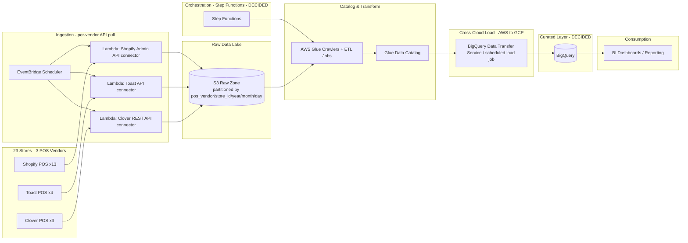

# POS Data Pipeline — Architecture Plan

Status: **Planning** — no infrastructure has been built yet. This document captures the proposed architecture and open decisions for a data pipeline covering 20+ retail stores.

## Goals

- Consolidate POS data from 20+ stores into a single source of truth.
- Support next-day reporting for all stores; leave room for same-day/near-real-time visibility if needed later.
- Keep cost low given bursty, end-of-day-heavy load patterns.

## Usage Pattern

- **Pipeline**: runs **daily** — ingest + merge/upsert new orders into the curated layer.
- **Analysis**: runs **weekly**, Fridays only. No same-day/real-time requirement.

This shapes the curated-warehouse decision below: idle-cost-during-the-week matters more than raw query throughput.

## Proposed Architecture



## Layer Notes

| Layer | Choice | Rationale |
|---|---|---|
| Ingestion | Per-vendor API pull (Shopify Admin API, Toast API, Clover REST API), scheduled via EventBridge + Lambda | All 3 vendors are cloud POS with REST APIs — no on-prem DB, so no DMS/CDC needed. Each vendor gets its own connector since schemas and auth differ |
| Raw lake | S3, partitioned by `pos_vendor/store_id/year/month/day` | Cheap, immutable, append-only; partitioning by vendor first keeps pre-normalization schema differences isolated |
| Catalog & transform | AWS Glue | Crawlers auto-sync schema as new store data lands; normalize 3 vendor schemas into one common order/transaction model here |
| Orchestration | **Step Functions** (decided) | Serverless, pay-per-state-transition, zero idle cost — fits a simple ~5-step daily DAG (3 connectors → Glue transform → BigQuery load). MWAA/Airflow and Dagster both carry a persistent base infrastructure cost (MWAA's smallest environment alone runs ~$350+/month) that would dwarf the rest of this pipeline's cost for a DAG this small |
| Curated warehouse | **BigQuery** (decided) | See below |

## Repo Layout

```
connectors/          # one class per vendor: polls the API, writes newline-delimited JSON to S3
lambda_handlers/      # thin Lambda entrypoints (one per vendor), loop over that vendor's stores
config/stores.example.yaml   # copy to stores.yaml (gitignored) and fill in real store/credential refs
gcp_alerting/teams_notifier/  # Pub/Sub-triggered Cloud Function: BQ DTS failure -> Teams webhook
requirements.txt
.env.example
```

Each connector polls its vendor's API for orders updated since the last run, validates each record,
and writes them to
`s3://<bucket>/<zone>/pos_vendor=<vendor>/store_id=<id>/year=/month=/day=/orders_<timestamp>.json`
where `<zone>` is `raw` (valid records) or `rejected` (records that failed validation).
Lambda handlers are meant to be triggered on a schedule (EventBridge), one rule per vendor, per the
architecture diagram above. This is boilerplate — auth flows, pagination, and error handling are
minimal and need hardening before production use.

### Retry & Backoff

All HTTP calls in `connectors/base.py` (`BasePOSConnector._request`) share one retry strategy:

- Retries on connection/timeout errors and on `429`/`500`/`502`/`503`/`504` responses.
- Exponential backoff with full jitter (`random.uniform(0, min(60s, 1s × 2^attempt))`), up to 5 attempts.
- Honors a vendor's `Retry-After` header when present, falling back to jittered backoff otherwise.
- S3 writes use boto3's `adaptive` retry mode (5 max attempts) for transient throttling on upload.

Caveat: Lambda has a 15-minute execution timeout. A worst-case run (5 attempts × up to 60s backoff)
could approach that limit if a vendor API is degraded — fine for boilerplate, worth monitoring once live.

### Data Validation

Each connector defines a `required_fields` tuple of top-level keys that must be present and
non-empty on every record (`BasePOSConnector.validate_record`, overridable per vendor for stricter
checks). `run()` splits each poll into two lists before writing to S3:

| Vendor  | `required_fields`               |
|---------|----------------------------------|
| Shopify | `id`, `created_at`, `total_price` |
| Toast   | `guid`, `businessDate`            |
| Clover  | `id`, `createdTime`                |

(Field names are a starting guess — verify against each vendor's actual Orders API response before
relying on them.)

- **Valid records** → `raw/` zone, as before.
- **Invalid records** → `rejected/` zone, same partitioning, with a `_validation_error` field
  appended describing which check failed (e.g. `missing required field: total_price`).

`run()` now returns `{"raw_key": ..., "rejected_key": ..., "rejected_count": ...}` (any of the keys
may be `None`/`0` if there were no valid or no rejected records that run) instead of a single S3 key
string. Lambda handlers merge this dict into their per-store result.

This is presence/non-empty validation only — no type, range, or referential checks yet. A Glue job
or scheduled query over `rejected/` is the natural place to alert on/triage bad data before it grows
silently.

## POS Integration Notes

| Vendor | Stores | Integration | Notes |
|---|---|---|---|
| Shopify | 13 | Admin REST/GraphQL API (poll); webhooks available | Mature API, well-documented, generous rate limits. Webhooks (order created/updated) are an option later for near-real-time without polling |
| Toast | 4 | Toast API (poll) | Requires Toast partner/API credentials per restaurant group — confirm access is available before building the connector |
| Clover | 3 | REST API (poll); webhooks available | App Market also offers pre-built export integrations worth evaluating vs. a custom connector |

## Curated Warehouse Evaluation (superseded by decision below)

| | Redshift Serverless | Delta/Iceberg on S3 (via Glue + Athena) |
|---|---|---|
| Cost model | Scales to near-zero when idle, but has warehouse-level compute overhead | Pay only for storage + per-query scan; ~$0 when idle |
| Best fit | Frequent/concurrent BI dashboard queries throughout the day | Mostly nightly/batch reporting, low query concurrency |
| AWS-native support | First-class | Strong for Iceberg; Delta requires Databricks or EMR for full feature support |
| Added complexity | Low — fully managed warehouse | Low-medium — need to pick a table format and compute engine |

Leaning toward **Iceberg over Delta** if staying AWS-native (no Databricks), since Athena/Glue/Redshift all have first-class Iceberg support.

### Curated Warehouse Charging Comparison

Given the [usage pattern](#usage-pattern) — daily merge/upsert, analysis only on Fridays — how each
platform *bills*, not just its list price, matters:

| Platform | Billing unit | Idle cost (Mon–Thu) | Daily merge/upsert cost driver | Friday analysis cost driver |
|---|---|---|---|---|
| **Redshift Serverless** | RPU-hours (per-second, 60s min) | Auto-pauses → ~$0 | Compute *time*, not bytes touched | Compute time during query burst |
| **BigQuery** (on-demand) | $ per TB scanned per query | $0 | **Bytes scanned** by the MERGE, including the target table if pruning is poor | Bytes scanned |
| **Azure Synapse Serverless SQL** | $ per TB processed | $0 | Bytes scanned (same model as BigQuery) | Bytes scanned |
| **Databricks (DBU)** | DBU-hour × cluster type, on top of VM cost | ~$0 with ephemeral Jobs clusters | Job cluster runtime | SQL Warehouse runtime (auto-suspends, cold-start lag on resume) |

Note: BigQuery/Synapse Serverless bill the daily MERGE by bytes scanned, so an unpruned merge against
a growing table gets quietly more expensive every day even though it's a small write. Redshift
Serverless and Databricks Jobs compute bill by time, so a well-partitioned nightly merge stays cheap
regardless of total table size. At this pipeline's actual volume (500-700MB/day), that distinction
turns out not to matter much — all options are cheap in absolute terms.

### Actual Volume: 500-700MB/day (millions of small rows)

Once real volume was known (500-700MB/day raw, ~15-21GB/month), rough all-in monthly cost estimates:

| Platform | Daily merge | Friday analysis | ~Total/month |
|---|---|---|---|
| **BigQuery** | Free tier (1TB scan + 10GB storage/month) likely covers this entirely | Free tier likely covers this too | **~$0-5** |
| **Redshift Serverless** | RPU-seconds for a sub-GB merge, negligible | RPU-seconds during the Friday session | **~$10-30** |
| **Snowflake** (hosted on AWS) | Per-second credit billing, auto-suspend — no free tier | Per-second credit billing during the Friday session | **~$10-30** |
| **Databricks** | Ephemeral Jobs cluster still pays ~5-8 min startup overhead per run | SQL Warehouse has no free tier; smallest serverless warehouse still ~$0.70/DBU-hr | **~$35-45** |

BigQuery's generous on-demand free tier (1TB scanned + 10GB storage per month) likely absorbs this
entire workload at zero query cost. Databricks comes out most expensive because its per-run cluster
startup overhead and lack of a free tier don't scale down with small data the way BigQuery's or
Redshift Serverless's billing does.

**Why not Snowflake?** It can run hosted on AWS, which would eliminate the BigQuery egress fee
entirely (data never leaves AWS's network). But it has no free tier — every second of warehouse
compute is billed in credits — so at this volume it lands around the same ~$10-30/month as Redshift
Serverless, not BigQuery's near-$0. Not worth adding a third vendor/billing relationship on top of
AWS + GCP just to remove a ~$1.50-2/month egress fee.

## Curated Warehouse: DECIDED — BigQuery

**Decision: BigQuery**, despite the rest of the stack (S3, Lambda, Glue, EventBridge) being AWS-native.
At this data volume the $ savings vs. Redshift Serverless are small (single-digit $/month), and the
tradeoff being accepted is operating two clouds instead of one — but BigQuery's free tier makes query
cost effectively $0 here, which was the deciding factor.

**Load mechanism: DECIDED — BigQuery Data Transfer Service (Amazon S3 transfer connector).**
Points at the S3 raw zone, runs daily, loads straight into BigQuery tables. No custom code, and
BigQuery load jobs are free — the only cost is the same ~$1.50-2/month S3 egress already accounted
for above. Ruled out:
- **BigQuery Omni** — avoids egress by querying S3 in place, but bills through BigQuery's slot/capacity
  pricing instead of on-demand, which would kill the free-tier cost advantage that justified picking
  BigQuery in the first place.
- **Custom Cloud Function / Cloud Run job** — would replicate what BQ DTS already does natively
  (reading S3, handling auth, loading into BigQuery), for no cost savings — just extra code and a
  second cross-cloud IAM relationship to maintain.

## Alerting & Failure Notifications (Microsoft Teams)

No service in this pipeline surfaces failures on its own — each needs to be explicitly wired up.

**AWS side (Lambda, Glue, Step Functions)** — one shared mechanism via **AWS Chatbot**:

| Service | Failure signal | Routes to |
|---|---|---|
| Step Functions | EventBridge rule: Execution Status Change = `FAILED`/`TIMED_OUT` | shared SNS topic |
| Glue | EventBridge rule: Glue Job State Change = `FAILED` | shared SNS topic |
| Lambda | CloudWatch Alarm on the `Errors` metric (per connector) | shared SNS topic |

Subscribe **AWS Chatbot** to that SNS topic, configured for the team's Microsoft Teams channel
(one-time channel authorization, no custom webhook code) — Chatbot posts formatted failure alerts
directly into Teams. Add an email subscription to the same SNS topic as a free backup channel.

**GCP side (BigQuery Data Transfer Service)** — Teams has no native Cloud Monitoring integration,
so this is the one spot in the whole pipeline that needs a small custom bridge:
- Enable BQ DTS's built-in **email notification** checkbox on the transfer config — zero setup, covers failures immediately.
- For Teams: **DECIDED — Pub/Sub → Cloud Function → Teams incoming webhook**. Cloud Monitoring alerting
  policy on the transfer's run-result metric publishes to Pub/Sub; a small Cloud Function formats the
  message and posts it to a Teams channel webhook URL. (Considered using Power Automate's HTTP-trigger
  flow to skip the Cloud Function entirely — ruled out, no Power Automate license available.) Code:
  `gcp_alerting/teams_notifier/`.

## Questions to Resolve Before Finalizing

- [x] Do all 20+ stores use the same POS system, or a mix? — Mix: Shopify (13), Toast (4), Clover (3)
- [x] Is next-day reporting sufficient everywhere, or is same-day/real-time needed? — No real-time need: pipeline runs daily (merge/upsert), analysis runs weekly on Fridays
- [x] Rough data volume per store per day (MB vs. GB)? — ~500-700MB/day total across all stores (millions of small rows)
- [x] Curated warehouse choice — **BigQuery**
- [x] Orchestration choice — **Step Functions** (MWAA/Airflow/Dagster ruled out: persistent base infra cost not worth it for a DAG this small)
- [x] How raw data on S3 gets loaded into BigQuery — **BigQuery Data Transfer Service** (S3 connector)
- [x] Failure alerting channel — **Microsoft Teams**, via AWS Chatbot (AWS side) and Pub/Sub → Cloud Function → Teams webhook (GCP/BQ DTS side)
- [ ] Confirm Toast API/partner credentials are available for all 4 stores
- [ ] How many users/dashboards will query the curated layer on Fridays, and how concurrently?
- [ ] Common data model to normalize Shopify/Toast/Clover orders into (line items, taxes, discounts, tenders likely differ per vendor)
